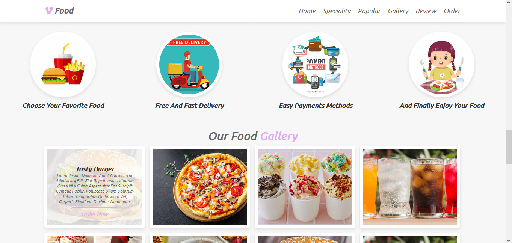
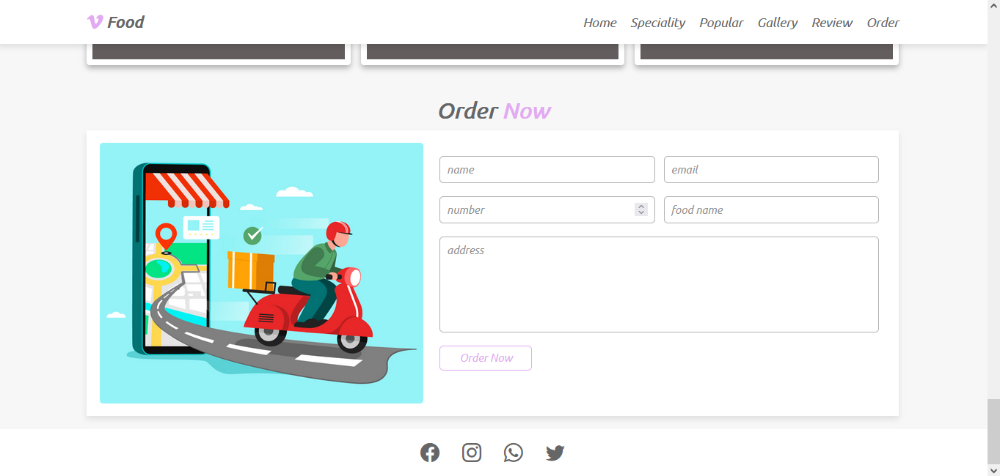

## 📍 Restaurant Website

💻 Responsive website for a restaurant offering food and beverages. The site includes a menu section showcasing the available dishes and drinks, as well as a contact form for customer inquiries.

💡 The web was built with HTML, CSS and JavaScript.

📌 The web is hosted on <a href="https://your-fav-restaurant.netlify.app/">Netlify</a>

### 💻 Home Page

### ✔ Speciality Section

### 🥪 Gallery Section

### 🍔⭐ Popular Section

### ☎ Contact Section

