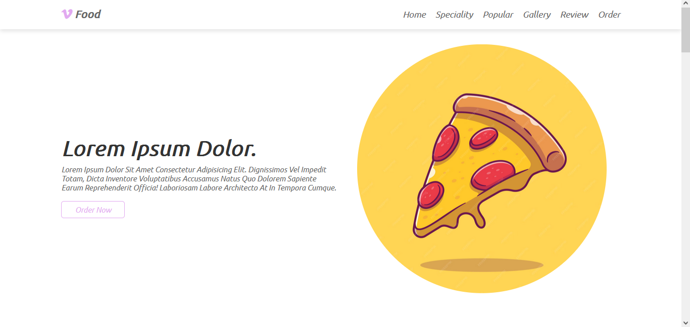

## 📍 Restaurant Website

  💻 Responsive website for a restaurant offering food and beverages. The site includes a menu section showcasing the available dishes and drinks, as well as a contact form for customer inquiries.    
  💡 The web was built with HTML, CSS and JavaScript.  
  📌 The web is hosted on <a href="https://your-fav-restaurant.netlify.app/">Netlify</a>

### Home Page 💻

### Speciality Section ✔

### Gallery Section 🥪

### Popular Section 🍔⭐

### Contact Section ☎

